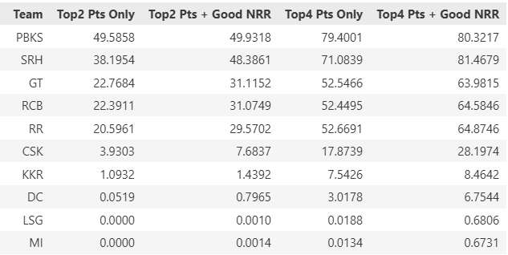
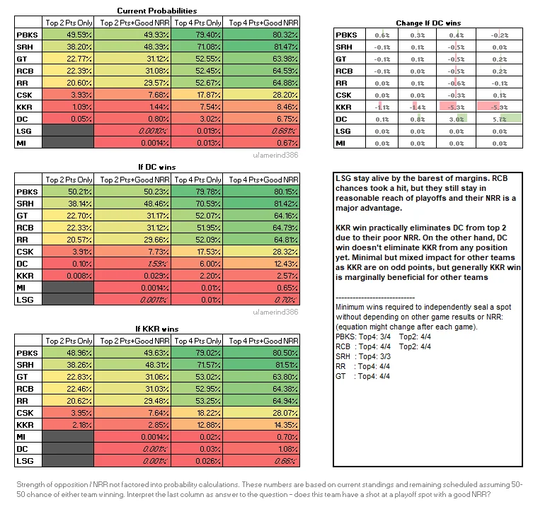
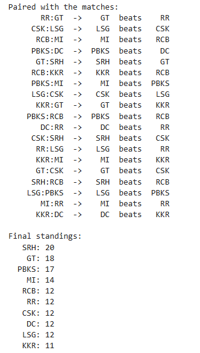

# ipl_scenarios_probability
IPL scenarios probability calculator

This repository recreates [`u/amerind386`](https://old.reddit.com/user/amerind386)'s IPL probability calculator, first posted on r/cricket. Starting from their own script - `ipl_playoff_probability_calculator.py` on [archive.org](https://web.archive.org/web/20230515162831/https://github.com/amerind386/IPL/blob/master/ipl_playoff_probability_calculator.py).

## Update: 20260507 - Current logic added

Logic of the NRR based calculation updated in `ipl_probs_v2.ipynb` to replicate the current calculations of u/amerind386. Adding images to show them here.

Image of the current logic script's output

[Image from u/amerind386's post today](https://old.reddit.com/r/Cricket/comments/1t6jzh8/playoff_probabilities_impact_of_dc_vs_kkr_game/)

## Update: 20260509 - Added mechanism for scenario lookup

Now, the logic can retrieve specific scenarios where a particular team reaches a certain outcome. Added example for MI reaching a top 4 confirmed scenario

